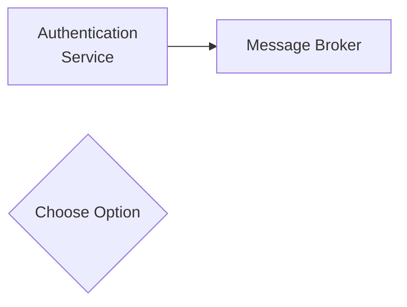

# Diagram Standards

All Mermaid diagrams in this repository follow the rules below. This file is
self-contained — there is no separate standards document. The CI check
[`check-mermaid-diagrams.py`](../scripts/check-mermaid-diagrams.py) enforces the
palette, size limits, and naming rules described here.

## When creating any diagram

1. Choose the diagram type (architecture / sequence / state / flowchart / ER / chart).
2. Apply a colour from the palette below.
3. Keep labels short — 3-4 words max per node.
4. Use subgraphs for logical grouping.
5. Aim for 15 nodes or fewer (a guideline, not a hard limit).
6. Check readability against a dark background (`color:#fff`).

## Colour Palette (dark theme)

| Meaning | Style |
|---------|-------|
| Problem / Removed | `fill:#8b3a3a,stroke:#ff6b6b,color:#fff` |
| Success / Added | `fill:#2d5f2d,stroke:#51cf66,color:#fff` |
| Warning / Changed | `fill:#8b5a00,stroke:#ffa94d,color:#fff` |
| Info / Neutral | `fill:#1a4d7a,stroke:#4dabf7,color:#fff` |
| Inactive / Unused | `fill:#3a3a3a,stroke:#888888,color:#fff` |

Use the core palette first. Neutral greys (`#555`, `#444`) are available for
muted or disabled elements. Always pair a dark fill with `color:#fff` text.

## Size Limits

- **Aim for ≤15 nodes** per diagram — exceed only when the diagram is clearer as a single unit.
- **Max 4 subgraphs** per diagram.
- **Max 3 colours** per diagram.
- **3-4 words max** per node label.
- **2-3 words max** per connection label.

## Layout Direction

- **Top-to-Bottom (TB):** process flows, hierarchies.
- **Left-to-Right (LR):** data flows, timelines.
- **Max depth:** 3 levels (main graph → subgraph → nodes).

## Node Naming

- **Format:** `NODEID[Display Label]` for plain text; `NODEID["Display Label"]` when the label contains HTML.
- **Line breaks:** use ` `. **Never use `\n`** — Mermaid renders `\n` as literal text.
- **Quoting rule:** when a label contains ` ` or any HTML tag, **always wrap it in double quotes** — `NODEID["Line 1 Line 2"]`. Unquoted labels with ` ` can fail to render in the kramdown → Mermaid pipeline because the markdown processor HTML-encodes `<` and `>` before Mermaid parses them.
- **No double curly braces:** never use Mermaid's hexagon shape `{{ }}` on Jekyll sites. Jekyll's Liquid engine processes `{{ }}` as variable output before Mermaid sees the diagram, breaking the syntax. Use a diamond `{ }` or stadium `([ ])` instead. (This does not reproduce in VS Code's local preview because VS Code does not run Liquid.)

## Connection Labels

Use action verbs and protocol names, 2-3 words max:

- ✅ `-->|Sends Messages| BROKER`
- ✅ `-.->|Calls API| SERVICE`
- ❌ `-->|Sends encrypted messages over the protocol| BROKER`

## Common Patterns

- **Before/After comparison:** subgraphs "Current" (red) vs "Proposed" (green).
- **Migration flow:** Current (red) → Migration (orange) → Target (green).
- **Dependencies:** components in subgraphs, databases with the `[( )]` shape.

## Diagram Type Selection

| Type | Use For |
|------|---------|
| `graph TB/LR` | Architecture, dependencies, infrastructure |
| `sequenceDiagram` | API interactions, message flows |
| `stateDiagram` | Lifecycle states, status transitions |
| `flowchart` | Decision trees, process flows |
| `erDiagram` | Database schemas, table relationships, data models |
| `xychart-beta` | Time-series data, metric comparisons, trend analysis |

## Init Block (themed diagram types)

Always include a `%%{init}%%` block for `sequenceDiagram`, `gantt`, `timeline`,
and `xychart-beta` — without it, colours may be invisible on light backgrounds.
Use `backgroundColor:'transparent'` so the chart has no white box.

## Accessibility

- Always use `color:#fff` on dark backgrounds.
- Don't rely on colour alone — use shapes, labels, and subgraphs to convey meaning.
