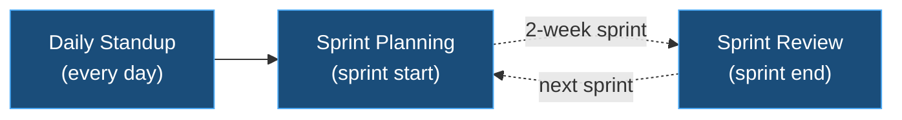

# 🔄 Ceremonies

Recurring team meetings used on the project.

---

## 🏉 Sprint Rules

| Rule | Value |
|------|-------|
| **Duration** | 2 weeks |
| **Starts on** | Monday |
| **Teams** | 2 |

---

## 📋 Ceremony Overview

| Ceremony | Cadence | Duration | Scope |
|----------|---------|----------|-------|
| [Daily Standup](daily-standup/README.md) | Daily | 15 min | Per team |
| [Sprint Planning](sprint-planning/README.md) | Per sprint | 1–2h | All teams |
| [Sprint Review](sprint-review/README.md) | Per sprint | 1h | All teams |
