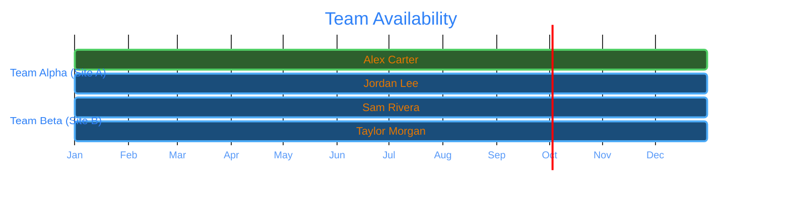

# 🗓️ Team Plan

Team composition over time. See [Teams](../foundation/teams/README.md) for team
definitions and [People](../people/README.md) for individual profiles.

> 💡 Placeholder data — replace the dates and names with your own schedule.

---

## 📉 Timeline Overview

---

## 🎨 Legend

| Color | Meaning |
|-------|---------|
| 🟦 Dark Blue | [developer](../foundation/roles/developer/README.md) |
| 🟩 Dark Green | [qa](../foundation/roles/qa/README.md) |
| 🟧 Dark Orange | [manager](../foundation/roles/manager/README.md) |

---

## Current Roster

| Name | Party | Role | Allocation |
|------|-------|------|------------|
| [Alex Carter](../people/alex-carter/README.md) | [Site A](../foundation/parties/site-a/README.md) | [developer](../foundation/roles/developer/README.md) | 100% |
| [Jordan Lee](../people/jordan-lee/README.md) | [Site A](../foundation/parties/site-a/README.md) | [qa](../foundation/roles/qa/README.md) | 100% |
| [Sam Rivera](../people/sam-rivera/README.md) | [Site B](../foundation/parties/site-b/README.md) | [developer](../foundation/roles/developer/README.md) | 100% |
| [Taylor Morgan](../people/taylor-morgan/README.md) | [Site B](../foundation/parties/site-b/README.md) | [manager](../foundation/roles/manager/README.md) | 100% |
