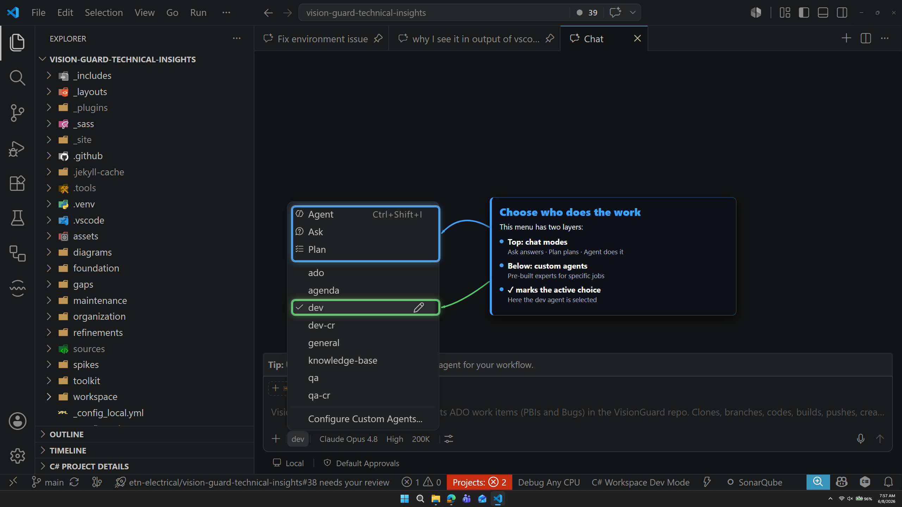

# 🎭 Agents and modes

| ← Previous | Next → |
|:---|---:|
| [Getting started](getting-started.md) | [Choosing a model](choosing-a-model.md) |

---

Click the **mode** button (#2 on the control bar) to choose **what the AI is allowed to do**.



## The three basic modes

| Mode | What it does | Use when |
|------|--------------|----------|
| **Ask** | Only answers questions. Changes nothing. | You want to learn or understand code |
| **Plan** | Makes a step-by-step plan first, then you say go | The task is big and you want to check the plan |
| **Agent** | Does the work — reads, edits, runs commands | You want the task done (most common) |

> ✅ **Default choice:** **Agent**. It can actually finish your task.

## Custom agents (the named ones)

Below the three modes you see **custom agents** — like `general`. These are **experts** with their own rules and tools built for this repository. Each one is documented in full — do not learn them here, follow the link:

| Agents | Documented in |
|--------|---------------|
| `general` | [Workspace — Agents](../README.md) |

The **check mark** ✓ shows which one is active. Pick the expert that matches your job, and it already knows the rules — you do not have to explain them.

> 💡 **Configure Custom Agents** at the bottom lets advanced users create new agents. You rarely need this.

---

## Which should I pick?

```text
Just asking a question?      ->  Ask
Want it done, normal task?   ->  Agent (general)
Big or risky task?           ->  Plan first, then Agent
```

---

| ← Previous | Next → |
|:---|---:|
| [Getting started](getting-started.md) | [Choosing a model](choosing-a-model.md) |
