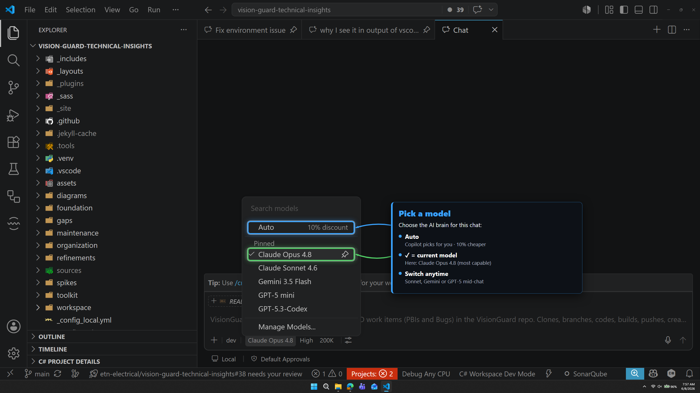
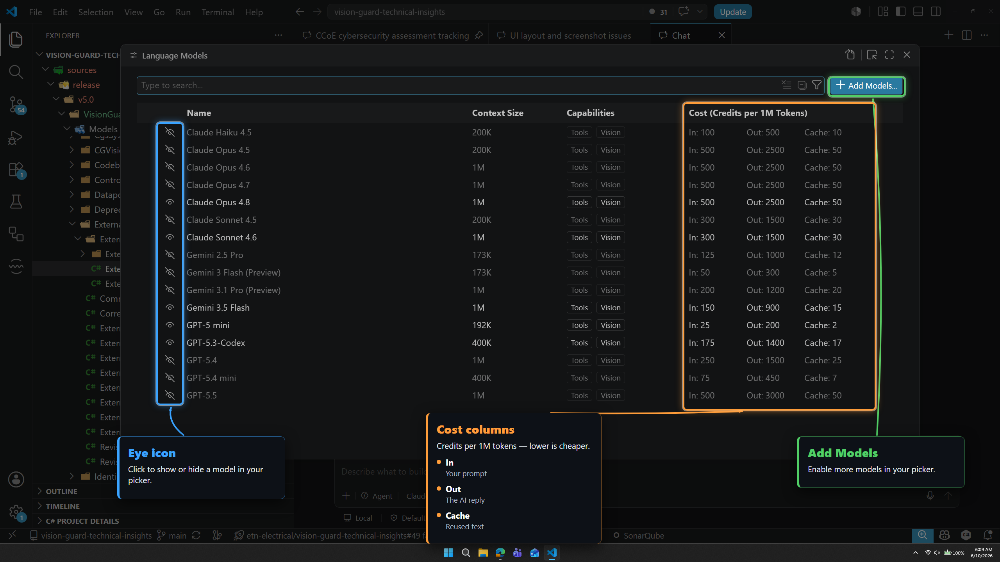

# 🧠 Choosing a model

| ← Previous | Next → |
|:---|---:|
| [Agents and modes](agents-and-modes.md) | [Thinking and context](thinking-and-context.md) |

---

The **model** is the AI brain. Click the **model** button (#3 on the control bar) to change it.

> 🎯 **The most important idea on this page:** **run on Auto, and spend your effort describing the task well.** Auto reads how hard the work is and escalates to a strong model on its own — while costing 10% less than picking that model by hand. Model selection is no longer a daily decision; task description is.

---

## ⭐ The golden rule

> **Auto by default. Plan mode with a strong model when the work is new.**

Auto has changed. It used to lean toward light, cheap models, so people picked the flagship manually to be safe. That is no longer true: **Auto judges the complexity of the task and selects a model to match it** — including the most capable one when the work genuinely needs it.

That moves the lever. The thing that decides whether you get a good result is no longer *which model you picked from the dropdown* — it is **how well the task was described**. A vague request handed to a flagship still produces vague work. A precisely described task handed to Auto gets a strong model *and* the 10% Auto discount.

| Your situation | What to do |
|---|---|
| **Running work that is already defined** — a `/`-skill, a repeatable task, anything your building blocks already describe | **Auto.** Every time. The thinking is already captured in the skill; Auto executes it. |
| **Something new or complex** — a feature, a tricky investigation, or authoring new skills, instructions and scripts | **Plan it in [Plan mode](agents-and-modes.md) with a strong model, then execute in Auto.** |
| **Something small** — a quick edit, an email, a lookup | **Auto.** Nothing to think about. |

---

## 🗺️ Why plan with a strong model, then execute on Auto

This is the one place where picking a model by hand still pays, and it is worth understanding why.

**Plan mode does not write code — it produces the plan.** That plan *is* your prompt for the implementation, and its quality decides everything that follows. So this is exactly where a strong brain earns its cost: it asks the right clarifying questions, spots the pitfalls, and turns a rough idea into a precise, complete description of the work.

Then you execute that plan in **Auto**:

- The task is now **described in detail**, so Auto reads it as the complex work it is and will typically choose a **comparable strong model** anyway.
- You get that model **10% cheaper** than selecting it by hand.
- Most importantly, you **stop paying for iterations.** The expensive part of AI work has never been the per-token rate — it is the ping-pong of a half-described task coming back wrong three times. Planning first removes most of those rounds.

> 💡 **Plan mode buys prompt quality before implementation starts.** For work that is already well defined, Auto alone is the best choice all the time. For something new, plan with a smart model, then let Auto carry it out.

See [Eaton costs and limits](eaton-costs-and-limits.md) for your monthly budget, and watch usage in the status bar — see [Running and monitoring](running-and-monitoring.md).

---

## 🤖 What Auto actually does

**Auto** hands model choice to Copilot, and it is **10% cheaper** than choosing the same model yourself.

- It **matches the model to the task**, escalating to a top-tier model when the work is complex.
- It reads the **whole context** it is given — your instructions, skills and the request itself — so the better the task is described, the better the model it picks.
- It removes a decision you would otherwise make dozens of times a day, usually with worse information than Copilot has.

The failure mode to avoid is not "Auto picked something too cheap" — it is **"the task was too vague for anything to judge it properly."** If Auto keeps under-delivering on something, the fix is almost always a sharper description or a plan, not a manual model override.

---

## 💰 What models cost

Cost is shown in **credits per 1 million tokens**, split into **In / Out / Cache** (your prompt / the AI reply / reused text). A token is about ¾ of a word, **1 credit = $0.01**, and **Out is the priciest** column — usually about **5×** the In rate, while reused **Cache** text is the cheapest.

You never have to guess: **hover any model** in the picker to see its exact rate before you switch.

> 💡 The **High cost** badge flags the priciest flagship models. Hover a couple and compare the **Out** column — the redundant ones jump out immediately.

---

## 🧹 Keeping the model list short

New models appear constantly, and most of the list is redundant. Rather than memorising a roster that is stale within weeks, apply these four rules whenever the list changes. They stay true no matter what the models are called this month.

| Rule | Test | Action |
|---|---|---|
| **1 — Newer wins at equal price** | A newer version costs the same as the older one | Keep the newest, hide the rest |
| **2 — Less capability, same price** | Two models cost the same but one has a smaller context window | Hide the smaller one |
| **3 — Pricier overlap** | Two models do the same job, one costs more | Hide the dearer one for that job |
| **4 — One model per job** | You already have a pick for this role | Hide every other candidate |

That leaves roughly one model per role — a **flagship** for the hardest work and planning, a **balanced** everyday model, a **coding-focused** one, and a **cheap fast** one for trivia. Which names fill those roles changes every few months (today they are the current Claude Opus and Sonnet generations alongside the current GPT and Gemini releases), so **read the live list rather than a list written down here.**

Turn models on and off with the **eye icon** in **Manage Models**:

- The **eye icon** shows or hides a model in your picker.
- The **cost columns** show credits per 1M tokens (In / Out / Cache) — the authoritative, current prices.
- **Add Models…** enables more brains.

> 💡 Because you run on Auto most of the time, a tidy list mainly matters for **plan mode**, where you do pick by hand.

---

## ✅ Putting it together

| You are… | Do this |
|----------|---------|
| **Running a defined task** — a skill, a repeat job | **Auto.** |
| **Starting something new or complex** | **Plan mode + a strong model**, then execute the plan in **Auto**. |
| **Doing something small** | **Auto.** |
| **Getting weak results from Auto** | Improve the description or write a plan — don't reach for the model picker first. |

### Want to stretch your budget further?

- Stay on **Auto** — it is 10% cheaper than picking the same model by hand.
- **Plan before you build.** Fewer wrong iterations saves far more than any per-token saving.
- Keep context at **200K** and reasoning on **High** unless you genuinely need more — see [Thinking and context](thinking-and-context.md).
- Start a **new chat per task** so you are not paying to re-read an unrelated conversation.

> ⚠️ The most expensive setup is a **flagship model + 1M context + Max reasoning**. Worth it for a hard problem you have planned properly; wasteful for a one-line change.

---

| ← Previous | Next → |
|:---|---:|
| [Agents and modes](agents-and-modes.md) | [Thinking and context](thinking-and-context.md) |
