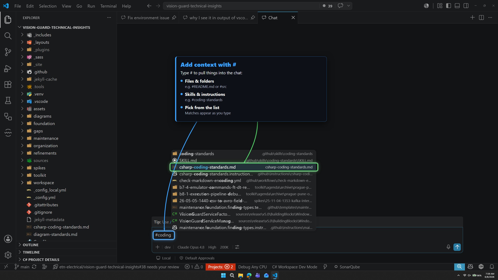
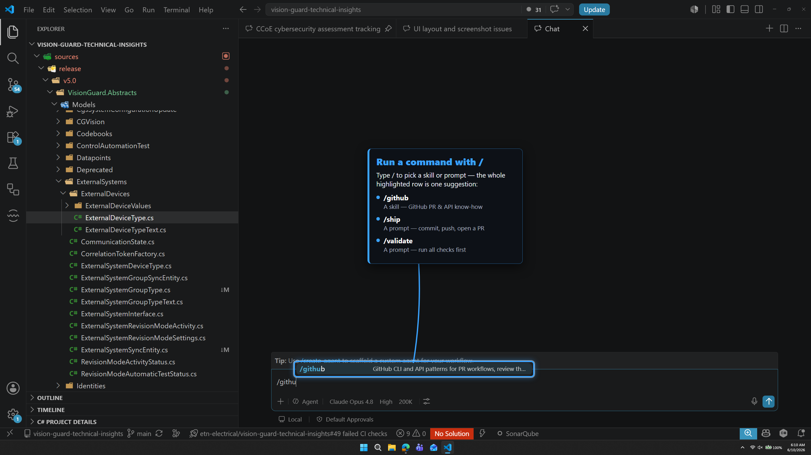

# 📎 Context and commands

| ← Previous | Next → |
|:---|---:|
| [Thinking and context](thinking-and-context.md) | [Permissions and autopilot](permissions-and-autopilot.md) |

---

Two special keys make the AI much smarter: **`#`** to add context, and **`/`** to run a command.

## `#` — add context

Type **`#`** in the chat box and pick a **file, folder, or skill**. The AI reads it before answering, so you get exact, correct results instead of guesses.

Examples:

- `#getting-started.md` — "explain this file"
- `#src` — "find the bug in this folder"
- `#coding-standards` — "follow these rules"

> ✅ Add only what you need. Too many files fill the memory box (see [Thinking and context](thinking-and-context.md)).

---

## `/` — run a command

Type **`/`** to run a **ready-made workflow** — a **[skill](customization-files/skills.md)** saved in this repository. One command does many steps for you.

Examples in this repository:

| Command | What it does |
|---------|--------------|
| `/ship` | Commit, push, open a pull request |
| `/validate` | Run all checks before shipping |
| `/fix-cr` | Work through the review comments on your pull request |

> 💡 Start typing and VS Code shows a list. You do not need to remember the names.

> 🧠 The same skills also load **without** a command — if your request matches one, the AI pulls it in by itself, and it can combine several of them in one chat.

---

## 🧱 The building blocks (what all these words mean)

You will hear three words. They are the **reusable knowledge** of this project — pieces that teach the AI how *we* work, so you do not have to explain the same things every time. They live **inside our repository** and are shared with everyone who opens it.

| Word | Plain meaning | Why it exists | You use it by |
|------|---------------|---------------|---------------|
| **Instruction** | A rule that turns on automatically for certain files | Keeps everyone consistent (naming, style, conventions) without anyone remembering | nothing — it just works |
| **Skill** | A saved task you can run **and** packaged know-how the AI loads when needed | Captures a multi-step job once so anyone can repeat it, and teaches the AI a topic only when it is relevant | typing `/name`, `#skill`, or letting the AI pick it |
| **Agent** | An expert mode with its own rules and tools | A ready-made specialist for a whole kind of work (dev, QA, docs) | picking it in the mode menu |

> 💡 You do not have to manage these. You **type a `/command`** or **pick an agent**, and it pulls in the right skills and instructions by itself.

> 🧭 **Skill or instruction?** A rule that must **always hold** → an instruction. Something you **do** or **look up** → a skill.

### You don't write these by hand — you ask the AI

This is the key idea: **these files are made *by* the AI, *for* the AI.** You almost never open or edit them yourself.

- When something **works well and you want to reuse it later**, ask the AI to **save it** — *"turn this workflow into a skill"*, *"capture these rules as an instruction"*, *"make a skill out of how we did this"*. It writes the file in the right place, in the right format.
- When an existing one **isn't behaving correctly**, ask the AI to **fix it** — *"this skill skips a step, update it"*, *"this agent ignores our naming rule, correct its instructions"*.

You just need to **know the three words and when each is useful**. The AI handles the conventions, the folder location, and the formatting. Think of them as building blocks you ask it to **snapshot, reuse, and improve** — never type from scratch.

> 🔎 **Want the full picture?** The [Customization files](customization-files.md) page is the deep dive — the `applyTo` property, how `.github/` mirrors the repo, and how all the pieces wire together in *our* app.

---

| ← Previous | Next → |
|:---|---:|
| [Thinking and context](thinking-and-context.md) | [Permissions and autopilot](permissions-and-autopilot.md) |
