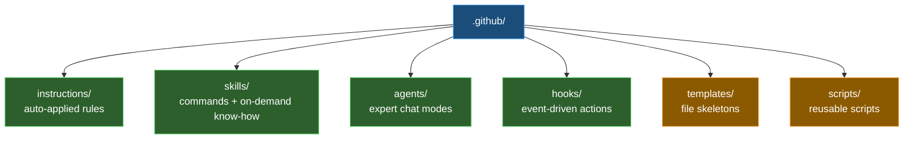
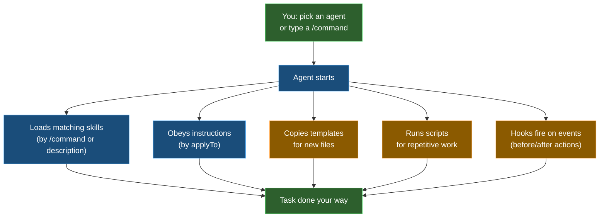

# 🧩 Customization files

| ← Previous | Next → |
|:---|---:|
| [Permissions and autopilot](permissions-and-autopilot.md) | [Running and monitoring](running-and-monitoring.md) |

---

*How this repo teaches the AI.* The [Context and commands](context-and-commands.md) page introduced three words — **instruction**, **skill**, **agent**. This page is the **deep dive**: what each one really is, the one property that makes it work, and how they are wired together in *this* repository.

> 💡 **You still don't write these by hand.** You ask the AI to create or fix them. But understanding *how* they work helps you ask for the right thing — and trust what the AI builds.

---

## 🗂️ One big rule: everything lives in `.github/`

All customization files live under the **`.github/`** folder, and that folder **mirrors the repository**. Where a file sits tells the AI when it applies.

Each subfolder of `.github/` matches a real part of the project. For example, the rules for the `organization/` folder live in `.github/instructions/organization/`. Same shape, different root.

---

## 🧱 The six building blocks

There are **six** kinds of customization file. This page is the **map** — one short paragraph each, with a link to its own deep-dive page where all the detail, patterns, and tricks live.

| # | Block | In one line | Deep dive |
|---|-------|-------------|-----------|
| 1 | **Instructions** | Rules that apply **themselves** to matching files | [Instructions](customization-files/instructions.md) |
| 2 | **Skills** | `/` **commands** *and* know-how loaded **only when needed** | [Skills](customization-files/skills.md) |
| 3 | **Agents** | Expert **chat modes** with their own rules | [Agents](customization-files/agents.md) |
| 4 | **Hooks** | Automation that **fires on an event** | [Hooks](customization-files/hooks.md) |
| 5 | **Templates** | The **skeletons** new files copy from | [Templates](customization-files/templates.md) |
| 6 | **Scripts** | Reusable **code** instead of re-thinking | [Scripts](customization-files/scripts.md) |

> 🗄️ **Where did prompts go?** There used to be a seventh block — prompt files. They are **retired**: every `/command` is now a skill. See [Prompts (retired)](customization-files/prompts.md) for the short why.

**1️⃣ Instructions** are rules the AI follows **automatically**. The magic property is **`applyTo`** — a file-path pattern. Edit a matching file and the rules switch on, no action from you. → [deep dive](customization-files/instructions.md)

**2️⃣ Skills** are the workhorse, and they have **two shapes at once**. A skill is a **recipe** you run by typing **`/name`** — `/ship`, `/validate`, `/pages`. It is *also* **know-how** the AI pulls in by itself when your task matches its **`description`**, with no command typed. Better still, **several skills combine in one chat window**: the agent loads each one as the work reaches it. → [deep dive](customization-files/skills.md)

**3️⃣ Agents** are whole **chat modes** — own instructions, own tools, own skills — picked from the mode menu. The `general` agent is the ready-made specialist that ships with this template. → [deep dive](customization-files/agents.md)

**4️⃣ Hooks** are automations tied to a **moment** — *before* a tool runs, *after* a file is edited, *when* a session starts. Unlike an instruction, a hook runs your own code and can **enforce** an outcome. → [deep dive](customization-files/hooks.md)

**5️⃣ Templates** are empty, correctly-structured starting files. The AI copies the matching one when it creates a new person record, email, or document, so the shape is always right. → [deep dive](customization-files/templates.md)

**6️⃣ Scripts** are small programs saved once and **run again and again** — the token-saving trick for deterministic, mechanical work. → [deep dive](customization-files/scripts.md)

---

## 🧭 Skill or instruction? (the one distinction to learn)

These two are the pair people mix up, because both can make the AI "just know" something. The difference is **who starts it**.

| Compare | **Instruction** | **Skill** |
|---------|-----------------|-----------|
| **What it is** | A standing **rule** | Something you **do** or **look up** |
| **How it starts** | By itself, on every file its **`applyTo`** glob matches | You type **`/name`**, *or* the AI matches your task to its **`description`** |
| **How much there is** | Short and always present | As big as it needs to be — loaded only when relevant |
| **Typical example** | "file names in this folder are lowercase-kebab-case" | "branch, commit, push, and open a pull request" |

> ✅ **Rule of thumb:** a rule that must **always hold** → an **instruction**. Something you **do** or **look up** → a **skill**.

---

## 🚫 The golden rule: reference, never embed
{: #golden-rule }

The single most important habit across **all** of these files: an instruction, skill, or agent should **point at** a script or template — never paste a copy of its contents inside.

It is tempting to drop "just a few lines" of a script or a chunk of a template skeleton straight into an instruction. **Don't.** Two things go wrong:

| Problem | Why it bites |
|---------|--------------|
| 🤖 **The AI hallucinates the rest** | When it sees only a *fragment* of a script or template, the AI fills in the missing parts by **inventing** them — guessing at logic it cannot see, and getting the details subtly wrong every time. |
| 🔁 **The same thing gets built many times** | Copy a snippet into three skills and you now have **three implementations** of one job. They drift apart, each behaves slightly differently, and every fix has to be made in every copy. |

The cure is simple: keep **one** real file — a [template](customization-files/templates.md) or a [script](customization-files/scripts.md) — and have every instruction, skill, and agent **link to it**. When the logic changes, you change it in one place and every caller stays correct.

> ✅ **One job, one home.** If you ever see a piece of script or a file skeleton living *inside* a skill or instruction, that's a bug — ask the AI to extract it into a script or template and reference it instead.

---

## 🏷️ The naming rule (why filenames look like that)

Because `.github/` mirrors the repo, file **names encode their path** using dots instead of slashes. This keeps every file unique and self-describing.

| File | Means |
|------|-------|
| `organization.instructions.md` | instructions for the `organization/` folder |
| `toolkit.email.template.eml` | the email template under `toolkit/email/` |
| `toolkit/word/build-document.py` | the generator script for `toolkit/word/`, under `.github/scripts/` |

> 🧩 **Skills are the exception.** Each one is a **folder** under `.github/skills/`, named in **kebab-case** — `create-customization/SKILL.md`, `toolkit-email-create/SKILL.md`. That folder name *is* the `/command` you type, so it reads left-to-right from area to action.

> 📝 You don't need to memorize this — the AI follows it when it creates a file. It is here so the names make sense when you see them.

---

## 🔄 How it all fits together

Here is the whole machine working as one. You only ever do the **green** parts.

**A real example:** you pick the **`general`** agent and say *"add a new person to the organization"*.

1. The **agent** sets the rules — it works with knowledge of this repo's structure and conventions.
2. It copies the **`organization.people.template.md`** **template** so the new person file has the right shape.
3. The **`applyTo: "organization/**"`** **instruction** quietly enforces the folder's conventions as it writes.
4. When the file is done, the agent registers it in the parent `README.md`.

You typed one sentence. The customization files did the rest.

---

## 🧠 The principles behind it

| Principle | What it means for you |
|-----------|------------------------|
| **Made by the AI, for the AI** | You ask; the AI writes the file in the right place and format |
| **Location = meaning** | Where a file lives (and its `applyTo`) decides when it applies |
| **Description drives discovery** | Skills and agents are chosen by their `description` — so write clear ones |
| **One concept per file** | Each file does one job, which keeps them easy to reuse and fix |
