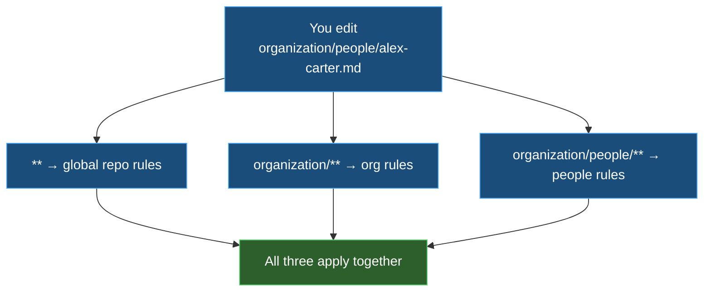

# 1️⃣ Instructions — rules that apply themselves

| ← Previous | Next → |
|:---|---:|
| [Customization files](../customization-files.md) | [Prompts (retired)](prompts.md) |

---

An **instruction** is a set of rules the AI follows **automatically**, with no action from you. You never "call" an instruction — the right rules are simply *present* whenever they are relevant. That is what makes instructions the quiet backbone of this repository.

The one property that makes it work is **`applyTo`** — a file-path pattern (a "glob"). When you touch a file that matches the pattern, the rules switch on.

```yaml
---
applyTo: "organization/**"
---
# Rules for organization files
- Use lowercase-kebab-case file names
- Link every role and person to its definition file
```

---

## 🎯 The `applyTo` pattern

The glob decides *when* the rules are live. The more specific the pattern, the narrower the scope.

| `applyTo` pattern | Turns on when you edit… |
|-------------------|-------------------------|
| `**` | **any** file (global rules for the whole repo) |
| `organization/**` | anything inside the `organization/` folder |
| `**/*.py` | any Python file, anywhere |
| `toolkit/email/**` | anything in the email toolkit |
| `.github/hooks/**` | any hook definition file |

> 💡 You can list **several** patterns separated by commas: `applyTo: "organization/**,toolkit/**"`.

---

## 🧱 How instructions stack

Multiple instruction files can match the same file at once. They **all** apply together — the global `**` rules plus every more-specific folder rule. There is no "winner"; the AI obeys the union of everything that matches.



This is why this repo has **many small instruction files** instead of one giant one: each folder carries only its own rules, and they combine automatically.

---

## 📂 Where they live

Instruction files live in `.github/instructions/`, mirroring the repository. The rules for `organization/` live in `.github/instructions/organization/`, named with the dot-path: `organization.instructions.md`.

> ✅ **Trick:** when the AI "just knows" a convention you never typed, an instruction matched. If it gets a convention *wrong*, the fix is usually to **add or sharpen an instruction** for that folder — not to repeat yourself in chat every time.

---

## 🧭 When to reach for an instruction

| Use an instruction when… | Use something else when… |
|--------------------------|--------------------------|
| The rule should apply **every time**, silently | You want to **run** a job on demand → [Skill](skills.md) |
| It is a **convention** for a folder or file type | It is **deep know-how** pulled in only when the task matches → [Skill](skills.md) |
| You want it **ambient**, never "called" | It is **executable logic** → [Script](scripts.md) |

---

| ← Previous | Next → |
|:---|---:|
| [Customization files](../customization-files.md) | [Prompts (retired)](prompts.md) |
