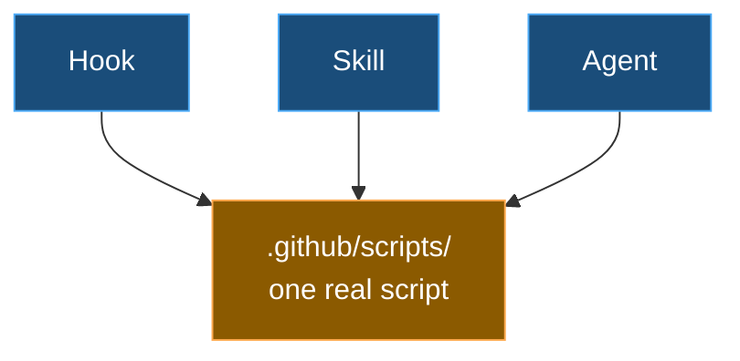

# 6️⃣ Scripts — reusable code instead of re-thinking every time

| ← Previous | Next → |
|:---|---:|
| [Templates](templates.md) | |

---

A **script** is a small program (PowerShell, Python, etc.) saved in `.github/scripts/` so it can be **run again and again**. It mirrors the repo structure just like templates and instructions.

This is a real **token-saving trick**. When a job is **deterministic** — the same mechanical steps every time, like "rename these files", "regenerate this Excel", or "check every link" — you don't want the AI re-reasoning it out token by token on each run. Instead:

1. Ask the AI to **write a script once** for that job.
2. From then on, the AI (or you) just **runs the script** — fast, cheap, and identical every time.

---

## 💰 The payoff

| Without a script | With a script |
|------------------|---------------|
| AI re-reasons every file, every run | AI runs one command |
| Burns tokens on mechanical work | Tokens spent only once, when writing it |
| Slightly different each time | Exactly the same every time |

> 💡 **Rule of thumb:** if a task is repetitive and mechanical, ask for a script. Save the AI's "thinking" budget for the parts that actually need judgement. See more in [Tips and tricks](../tips-and-tricks.md).

---

## 🔢 Scripts speak `KEY=value`

A script that another step needs to read from prints **machine-readable** lines — simple `KEY=value` output — so the AI parses the result deterministically instead of guessing from prose. Each domain folder under `.github/scripts/` carries a `README.md` cataloguing its scripts, their parameters, and their outputs.

---

## 🔗 Scripts are what hooks, skills, and agents point at

A script is the **one canonical home** for a piece of logic. A [hook](hooks.md) names a script to run on an event; a [skill](skills.md) calls one as a step, or references it for the mechanical parts of its know-how; an [agent](agents.md) reaches for the same script rather than improvising. None of them paste the logic inline — that is the [golden rule](../customization-files.md#golden-rule).

> ✅ **One job, one home.** Change the script once and every hook, skill, and agent that calls it stays correct automatically.

---

| ← Previous | Next → |
|:---|---:|
| [Templates](templates.md) | |
