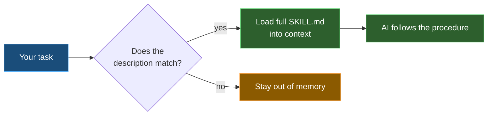

# 2️⃣ Skills — commands *and* know-how the AI loads only when needed

| ← Previous | Next → |
|:---|---:|
| [Prompts (retired)](prompts.md) | [Agents](agents.md) |

---

A **skill** is a folder with a **`SKILL.md`** file inside it. It is the single building block behind **every `/command`** in this repository — [prompt files are retired](prompts.md), and a skill does everything they did and more.

---

## 🎭 A skill has two shapes — and can be both

| Shape | What it is | How it starts |
|-------|------------|---------------|
| 🧾 **Recipe** | A job with steps — *branch, commit, push, open a PR* | You type **`/name`** in the chat box |
| 📚 **Know-how** | Reference knowledge — our conventions, a brand system, an API | The AI loads it when your task matches its **`description`** |

The same file can be both: `/ship` is a recipe you run by name, and `github-conventions` is know-how that arrives on its own — but either one can be summoned the other way. You are never forced to remember a command.

The clever part is *lazy loading*: the AI reads only the skill's short **`description`** all the time, and pulls in the full, detailed body **only when your task matches**. That keeps its memory free for the rest of the time.

```yaml
---
name: github-conventions
description: "Decide which .github/ customization artifact to create,
where to put it, and how to name it. Use when creating or moving a
file under .github/."
---
# GitHub Conventions — full step-by-step know-how…
```

---

## 🧩 The two properties that matter

| Property | Job |
|----------|-----|
| **`name`** | Short id for the skill |
| **`description`** | **When** to use it — the AI matches your task against this. Make it precise. |
| **body** | The actual deep knowledge, loaded **on demand** |

> ✅ **Descriptions are everything.** A skill with a vague description never gets picked; a precise one fires exactly when it should. Write the description as *"Use when the user wants X / is doing Y"* — name the triggers.

---

## 🔗 Skills chain — several in one chat window

This is the property that made prompt files obsolete. Because a skill loads **on demand**, the agent can pull in **several of them in the same conversation**, one after another, as the work reaches each part — you do not open a new chat and you do not type a second command.

Ask for *"build a deck about Q3 and put it on SharePoint"* and the agent loads **`toolkit-presentation-create`** to plan the deck, **`office-documents`** for the brand system, then **`sharepoint-upload`** to publish it. One request, three skills, one window.

> 💡 This is why you can describe the **whole outcome** you want instead of running a chain of commands yourself.

---

## 🧠 Skill or instruction?

An [instruction](instructions.md) is **always on** for matching files — great for short, ever-present rules. A skill is **big and occasional** — a whole procedure or body of knowledge you only need now and then. Loading it always would waste memory; loading it on demand is the win.

> 🧭 **Rule of thumb:** a rule that must **always hold** → an [instruction](instructions.md). Something you **do** or **look up** → a **skill**.



---

## 📂 Where they live

Skills live in `.github/skills/<skill-name>/SKILL.md`. Each skill is its own folder, so it can carry helper files alongside the `SKILL.md`. The folder name is **kebab-case**, and it *is* the command you type.

| Skill | Shape | Try it |
|-------|-------|--------|
| `ship` | Recipe | **`/ship`** — branch, commit, push, open a PR |
| `validate` | Recipe | **`/validate`** — run every CI check locally |
| `toolkit-word-create` | Recipe | **`/toolkit-word-create`** — build a styled `.docx` |
| `github` | Know-how | `gh` CLI and PR workflows, loaded when you work with pull requests |
| `github-conventions` | Know-how | which `.github/` artifact to create and how to name it |

> 💡 **Trick:** if the AI keeps *not* using a skill you expect, the description is too vague or doesn't name your trigger words. Sharpen it — that is almost always the fix.

---

| ← Previous | Next → |
|:---|---:|
| [Prompts (retired)](prompts.md) | [Agents](agents.md) |
