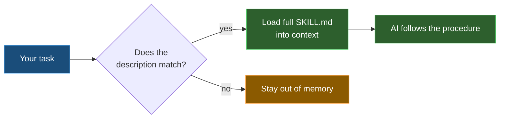

# 3️⃣ Skills — know-how the AI loads only when needed

| ← Previous | Next → |
|:---|---:|
| [Prompts](prompts.md) | [Agents](agents.md) |

---

A **skill** is a packet of domain knowledge stored in a folder with a **`SKILL.md`** file. The clever part is *lazy loading*: the AI reads only the skill's short **`description`** all the time, and pulls in the full, detailed body **only when your task matches**. That keeps its memory free for the rest of the time.

```yaml
---
name: github-conventions
description: "Decide which .github/ customization artifact to create,
where to put it, and how to name it. Use when creating or moving a
file under .github/."
---
# GitHub Conventions — full step-by-step know-how…
```

---

## 🧩 The two properties that matter

| Property | Job |
|----------|-----|
| **`name`** | Short id for the skill |
| **`description`** | **When** to use it — the AI matches your task against this. Make it precise. |
| **body** | The actual deep knowledge, loaded **on demand** |

> ✅ **Descriptions are everything.** A skill with a vague description never gets picked; a precise one fires exactly when it should. Write the description as *"Use when the user wants X / is doing Y"* — name the triggers.

---

## 🧠 Why not just use an instruction?

An [instruction](instructions.md) is **always on** for matching files — great for short, ever-present rules. A skill is **big and occasional** — a whole procedure you only need now and then. Loading it always would waste memory; loading it on demand is the win.



---

## 📂 Where they live

Skills live in `.github/skills/<skill-name>/SKILL.md`. Each skill is its own folder, so it can carry helper files alongside the `SKILL.md`. This template ships skills like `github` (PR and CLI workflows) and `github-conventions` (which `.github/` artifact to create and how to name it).

> 💡 **Trick:** if the AI keeps *not* using a skill you expect, the description is too vague or doesn't name your trigger words. Sharpen it — that is almost always the fix.

---

| ← Previous | Next → |
|:---|---:|
| [Prompts](prompts.md) | [Agents](agents.md) |
