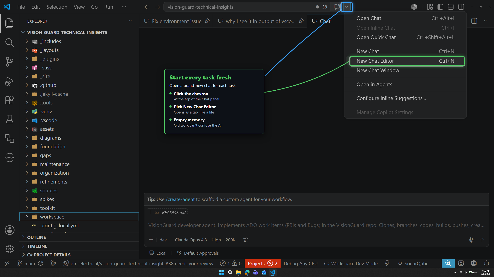
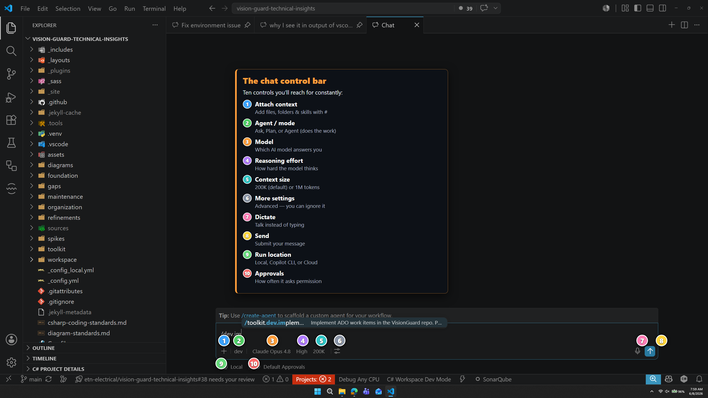

# 🏁 Getting started

| ← Previous | Next → |
|:---|---:|
| [Guide index](README.md) | [Agents and modes](agents-and-modes.md) |

---

## 1. Open the Chat panel

Click the Copilot icon in the title bar.

## 2. Always start a new task in a new chat editor

Click the **chevron** at the top of the Chat panel and pick **New Chat Editor**. The chat opens as a **tab in the editor area** (like a normal file tab) with **empty memory**.

> ✅ **Why a fresh chat?** Empty memory means old, finished work cannot confuse the AI. One task = one new chat editor.

### Run many chats in parallel

A chat editor is just a **tab**, so you can open **as many as you like** — exactly like opening several files side by side. You do not have to wait for one chat to finish before starting the next.

A single prompt can easily run for an hour. Instead of watching it, **open another chat tab and start a different task** while the first one works. Come back when it is done, check the result, and kick off the next one.

> 🧑‍💼 **Think of it like managing a team.** Each chat is a worker. You hand one a task, then turn to another and hand it a task too. They all work at the same time — you just **orchestrate**. The work runs in parallel even though *you* talk to them one at a time.
>
> 💡 You start prompts **sequentially** (open a tab, type, send; open another, type, send), but they **run in parallel**. This is one of the most powerful ways to get more done.

## 3. Type your request

Write what you want in plain words and send it. That is it.

---

## 🧩 The control bar — your cockpit

At the bottom of the Chat panel is the **control bar**. Every button here changes how the AI behaves. Learn these ten and you know everything.

| # | Button | What it does | Page |
|---|--------|--------------|------|
| 1 | **Attach (`#`)** | Add files, folders, or skills as context | [Context and commands](context-and-commands.md) |
| 2 | **Agent / mode** | What the AI is allowed to do | [Agents and modes](agents-and-modes.md) |
| 3 | **Model** | Which AI brain answers you | [Choosing a model](choosing-a-model.md) |
| 4 | **Reasoning** | How hard it thinks | [Thinking and context](thinking-and-context.md) |
| 5 | **Context size** | How much it can remember | [Thinking and context](thinking-and-context.md) |
| 6 | **More settings** | Extra options | *Ignore it* |
| 7 | **Dictate** | Talk instead of type | — |
| 8 | **Send** | Send your message | — |
| 9 | **Run location** | Local PC, CLI, or cloud | [Permissions and autopilot](permissions-and-autopilot.md) |
| 10 | **Approvals** | How much it can do on its own | [Permissions and autopilot](permissions-and-autopilot.md) |

> 💡 You can type your message and **send right away** with the defaults. The other buttons are there when you want more control.
>
> 🚫 **Button #6 (More settings)** holds advanced extras. **Leave everything default** and ignore this button unless you really know what a setting does. You never need it for normal work.

---

| ← Previous | Next → |
|:---|---:|
| [Guide index](README.md) | [Agents and modes](agents-and-modes.md) |
