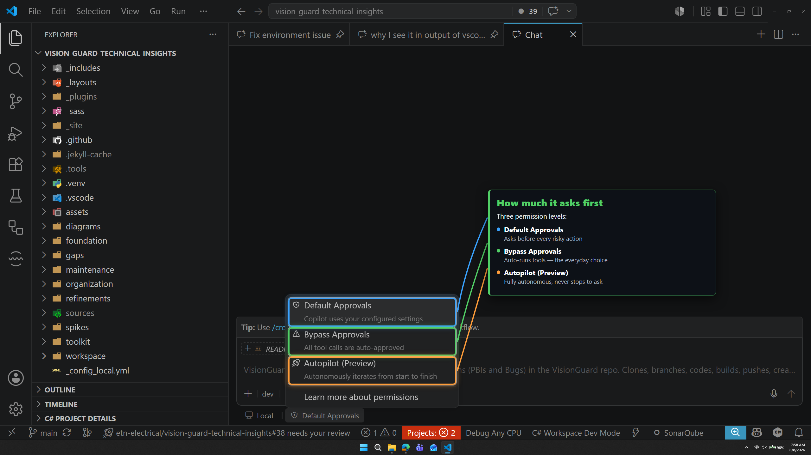
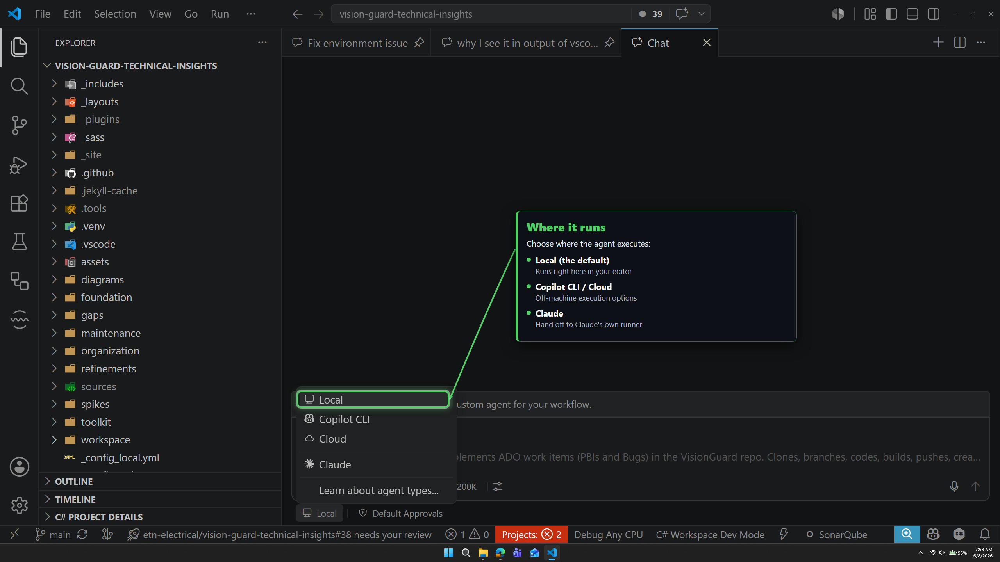
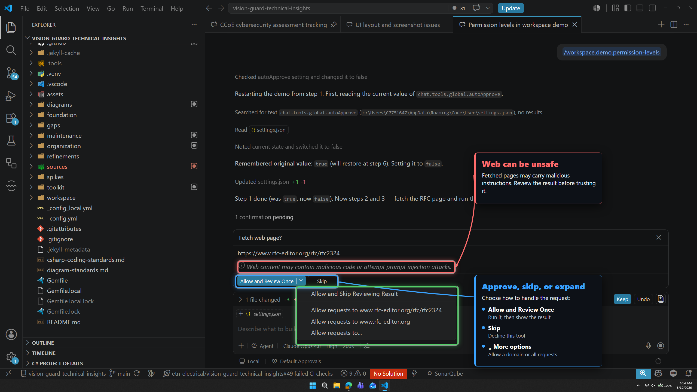
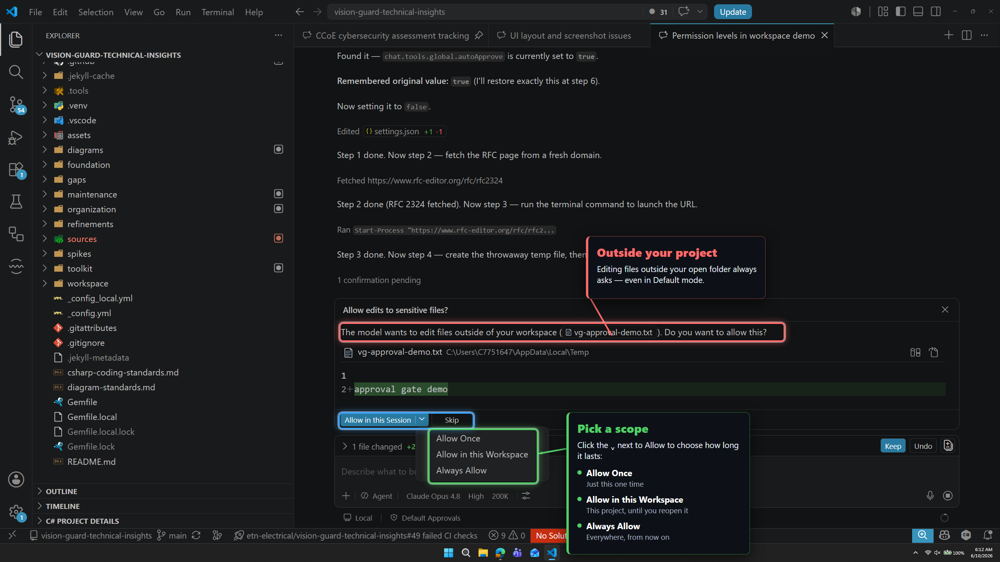
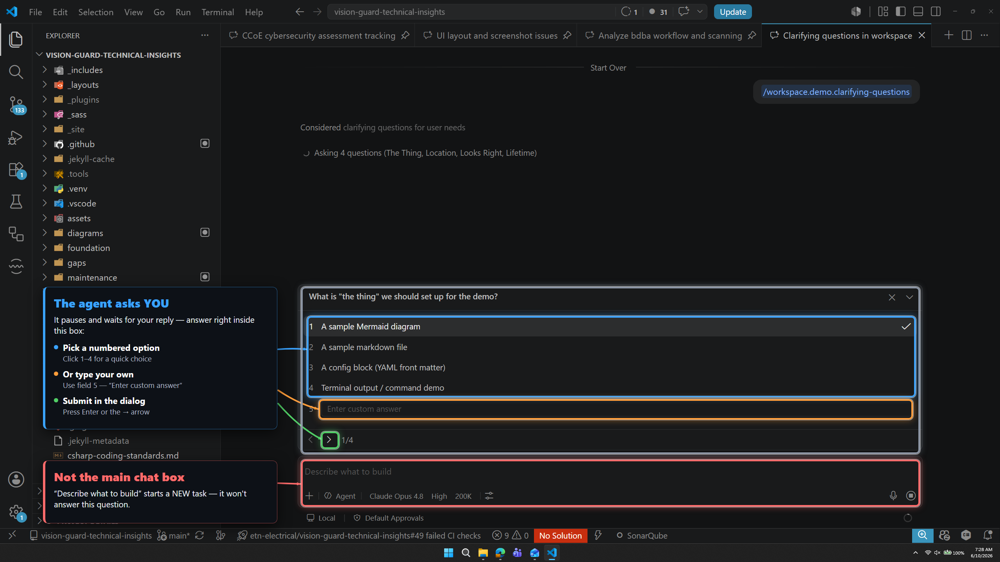

# 🔐 Permissions and autopilot

| ← Previous | Next → |
|:---|---:|
| [Context and commands](context-and-commands.md) | [Customization files](customization-files.md) |

---

This is the most important page for **trust**. You decide how much the AI can do **without asking you**.

## Approvals (button #10)

| Level | What happens | Good for |
|-------|--------------|----------|
| **Default Approvals** | Asks you before risky steps (run a command, edit outside the project) | Learning — your first days |
| **Bypass Approvals** | Auto-approves every **tool** (commands, edits, web). Still **asks you clarification questions** when it needs a decision. | **Everyday work** — the normal mode once you are comfortable |
| **Autopilot Preview** | Fully autonomous. Plans and iterates by itself and **does not stop on its own to ask for guidance** — it decides and keeps going. If a tool or prompt explicitly asks you a question, that still needs your answer. | Tasks you can fully hand over |

> ✅ **Recommended path:** start on **Default** while you learn what the AI does. Then move to **Bypass** and stay there — it removes the constant approval pop-ups but still pauses to ask *you* when a real decision is needed. That is the comfortable everyday mode.
>
> ⚠️ **Autopilot is different.** It will **not stop on its own** to ask for clarification — if something is unclear, it decides and keeps going. (An explicit interactive question raised by a tool or prompt still waits for your input.) Only use Autopilot when you already know how it behaves and you are fine with it making those calls without you.
>
> 💡 Whichever mode you use, keep your work in **Git** so any change can be undone.

---

## Where it runs (button #9)

| Location | Meaning |
|----------|---------|
| **Local** *(default)* | Runs on **your PC**. Normal choice. |
| **Copilot CLI** | An agent in your terminal |
| **Cloud / Claude** | Runs on a remote machine |

> ✅ Keep **Local** unless you have a reason to change it.

---

## What an approval prompt looks like

Even in Default mode, the AI is polite — it asks before doing something that could matter.

### Running a tool (for example, fetching a web page)

- Click **Allow** to let it happen once.
- The **arrow** opens more choices — allow this whole website every time, skip review, etc.
- ⚠️ Web pages can contain hidden tricks ("prompt injection"). The AI warns you. Only allow pages you trust.

### Editing a file outside your project

Editing files **outside** your open folder **always** asks — even in Default mode. Choose the scope:

| Choice | Lasts |
|--------|-------|
| **Allow Once** | This one time |
| **Allow in this Session** | Until you close VS Code |
| **Allow in this Workspace** | For this project, always |
| **Always Allow** | Everywhere, forever |

---

## When the AI asks *you* a question

Sometimes the AI needs a decision from you. It shows choices — pick one and click **Submit**.

> 💡 This is normal and good — it means the AI is being careful instead of guessing.

---

| ← Previous | Next → |
|:---|---:|
| [Context and commands](context-and-commands.md) | [Customization files](customization-files.md) |
