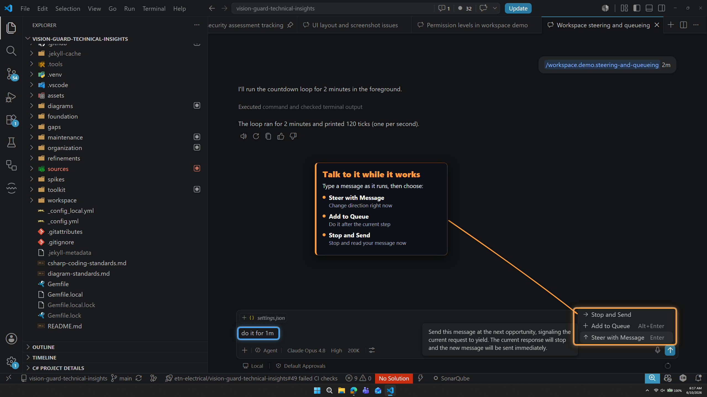
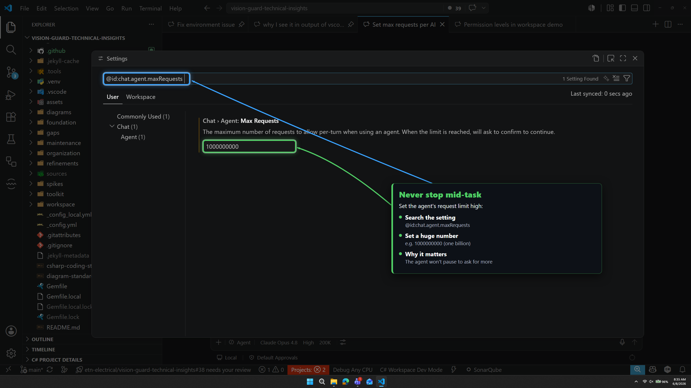
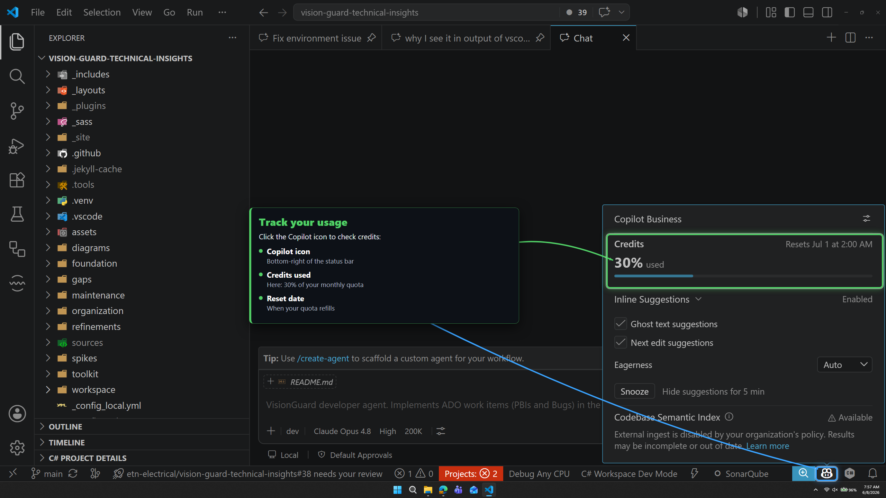

# 🏃 Running and monitoring

| ← Previous | Next → |
|:---|---:|
| [Customization files](customization-files.md) | [Recommended settings](recommended-settings.md) |

---

How to **steer** the AI while it works, **watch your usage**, and make sure it **never stops early**.

## Talk to it while it works (steering)

You do not have to wait. Type a message while the AI is running and pick what to do:

| Choice | What happens |
|--------|--------------|
| **Steer with Message** | Change direction right now |
| **Add to Queue** | Do this after the current step |
| **Stop and Send** | Stop and read your message now |

> 💡 Use steering to nudge the AI ("use 30 seconds instead") without starting over.

> 🛑 To stop the AI completely, click the **Stop** button in the chat input box.

---

## ♾️ Never stop mid-task — set Max Requests to the max

By default the AI **pauses after a number of steps** and asks "keep going?". On a big task this is annoying and breaks the flow. Turn it off.

1. Open **Settings** (File → Preferences → Settings).
2. Search for **`chat.agent.maxRequests`**.
3. Set it to a huge number: **`1000000000`**.

> ✅ **There is no good reason to limit this.** Let the agent finish the whole task without stopping to ask.

*(This is also in the importable [Recommended settings](recommended-settings.md).)*

---

## 👀 Watch your usage

Click the **Copilot icon** in the bottom-right **status bar** to see how many credits you have used and when they reset.

> ✅ **Check it often.** Powerful models and 1M context use credits faster. If usage climbs quickly, switch to a cheaper model (see [Choosing a model](choosing-a-model.md)).

### Simple ways to spend less

- ✅ Use **Auto** or a cheap model for simple work.
- ✅ Keep context at **200K**.
- ✅ Start a **new chat** per task so the memory box stays small.
- ✅ Add only the files you need with `#`.
- ❌ Do not run **Opus 4.8 + 1M + Max reasoning** for a one-line change.

---

| ← Previous | Next → |
|:---|---:|
| [Customization files](customization-files.md) | [Recommended settings](recommended-settings.md) |
