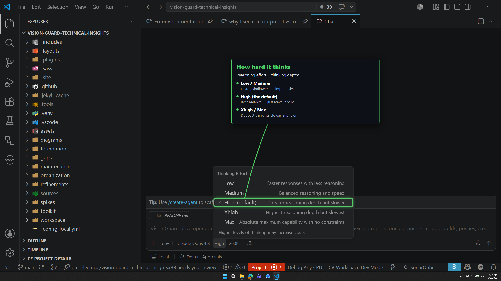
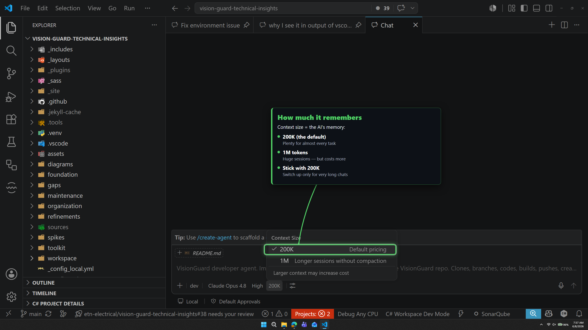
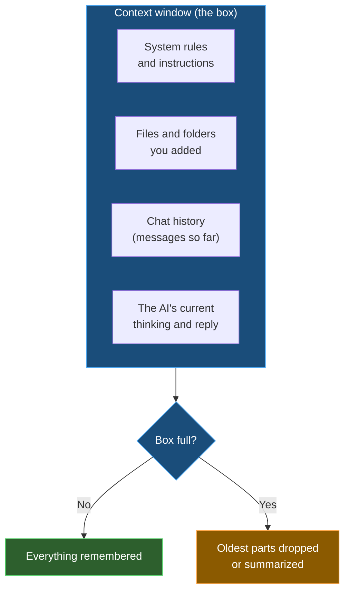
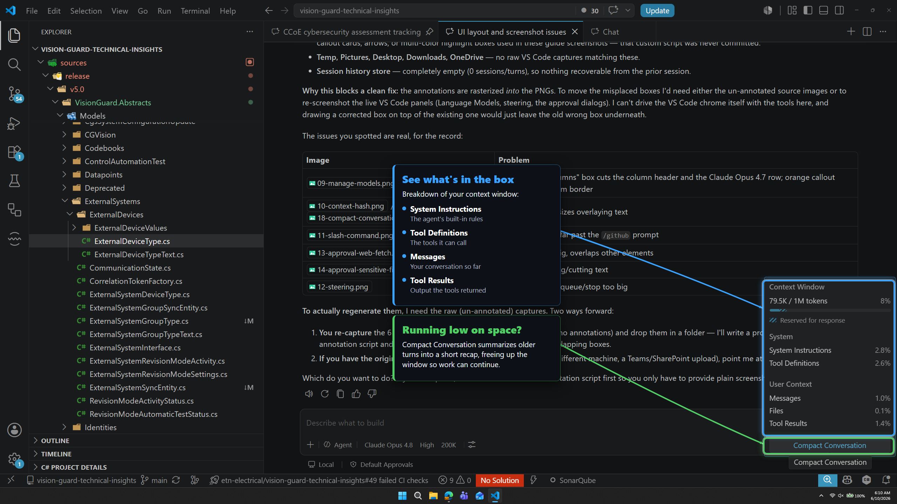

# 🤔 Thinking and context

| ← Previous | Next → |
|:---|---:|
| [Choosing a model](choosing-a-model.md) | [Context and commands](context-and-commands.md) |

---

Two buttons control **how hard the AI thinks** and **how much it can remember**.

## Reasoning effort (button #4)

Higher effort = the AI thinks more before answering. Slower, smarter, **costs more**.

| Level | Use for |
|-------|---------|
| **Low / Medium** | Simple edits, quick questions |
| **High** *(default)* | Normal work — leave it here |
| **Xhigh / Max** | Very hard problems, tricky bugs |

> 💡 Leave it on **High**. Only go higher when the AI is getting a hard problem wrong.

---

## Context size (button #5)

This is the AI's **short-term memory** — how much text it can hold at once.

| Size | Meaning |
|------|---------|
| **200K** *(default)* | Normal usage. Good for almost everything. |
| **1M** | Much longer memory. You pay for every token in the box on **each** turn, so a full 1M session **costs more**. Long sessions only. |

> ✅ Keep **200K** unless you are in a very long session and the AI starts forgetting earlier steps.

---

## 📦 What is the "context window"?

Think of context as a **box**. Everything the AI knows *right now* must fit in the box: your messages, the files it read, its own replies, and the rules it follows.

When the box gets **full**, the oldest parts are dropped or squeezed into a short summary. That is when the AI can "forget" something from early in a long chat.

### How to avoid a full box

- ✅ Start a **new chat** for each task (chat panel chevron → *New Chat Editor*). Empty box again.
- ✅ Only add the files you actually need with `#`.
- ✅ Use **1M context** only when a single task is genuinely long.
- ❌ Do not keep one giant chat open for days.

> 💡 A bigger box (1M) is not always better — you pay for every token inside it on each turn, so a full box costs more, and a focused small box often gives sharper answers.

---

## 👀 See what's in the box

Click the small **context % indicator** on the control bar to open the **Context Window** panel. It shows exactly what is filling the box right now.

The breakdown tells you where the space goes:

| Part | What it is |
|------|------------|
| **System Instructions** | The built-in rules the AI follows |
| **Tool Definitions** | The list of actions the AI can take |
| **Messages** | Your chat so far |
| **Tool Results** | Output from files read, commands run, etc. |

### Do I need to press "Compact Conversation"?

**Almost never.** When the box fills up, VS Code **compacts it for you automatically** — it summarizes the old history and keeps going. You usually never have to think about it.

The **Compact Conversation** button just does the same thing *early*, by hand. Leave it alone unless you really know why you want to compact right now.

> ⚠️ **Don't reach for this button as a beginner.** Compacting always loses some detail. If the AI starts forgetting things, the better fix is a **new chat** (chat panel chevron → *New Chat Editor*) for your next task — not manual compacting.

---

| ← Previous | Next → |
|:---|---:|
| [Choosing a model](choosing-a-model.md) | [Context and commands](context-and-commands.md) |
